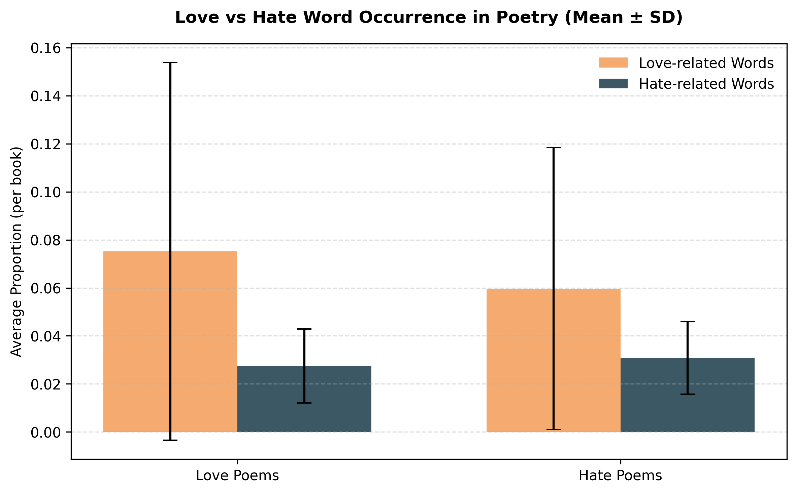
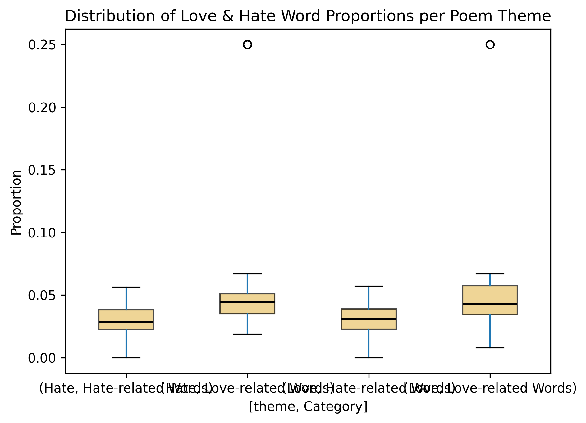
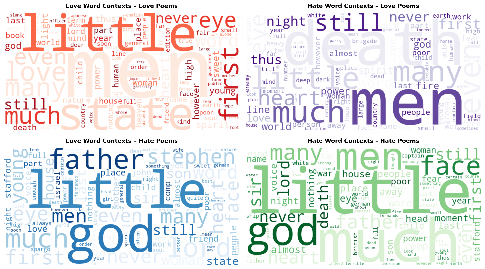
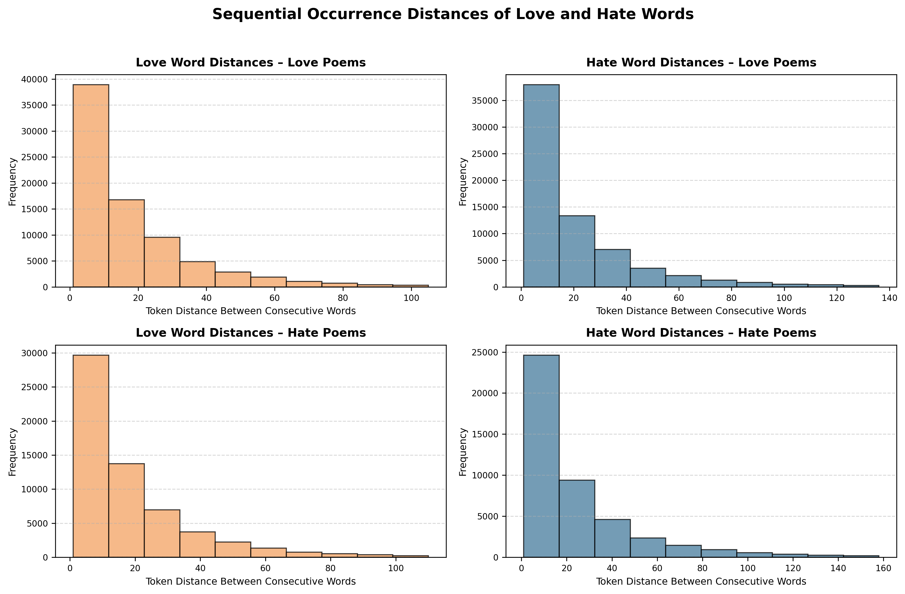
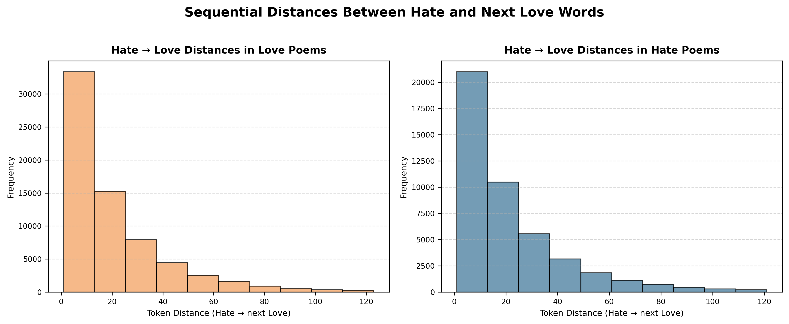
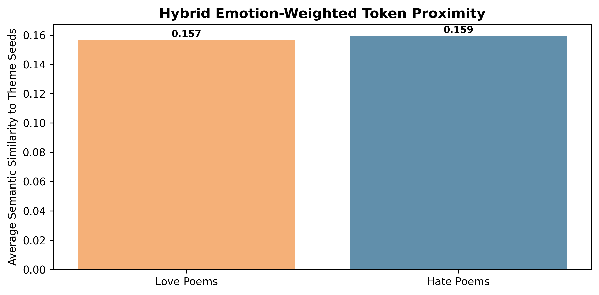
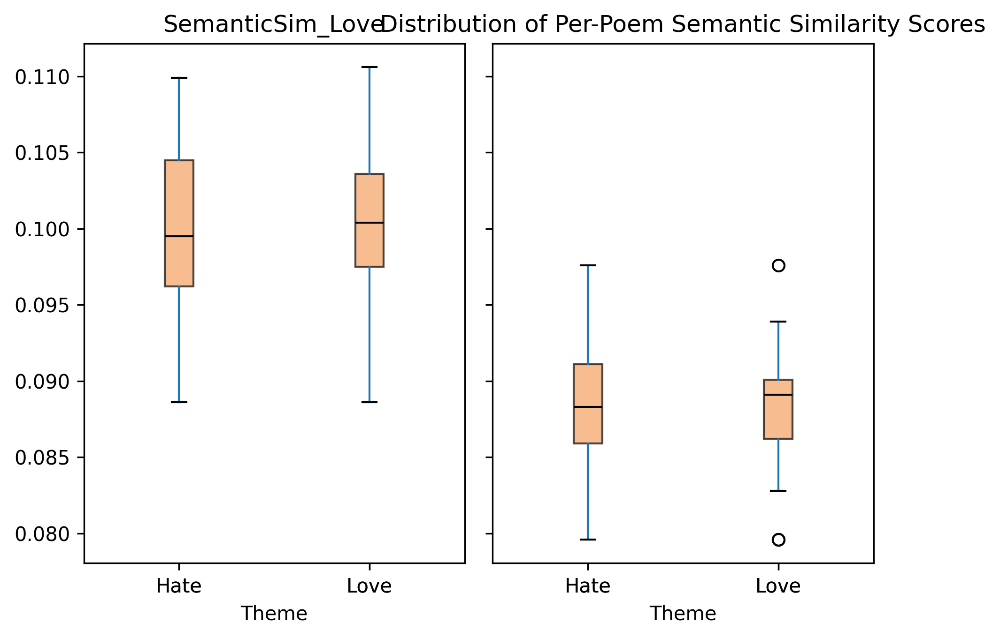
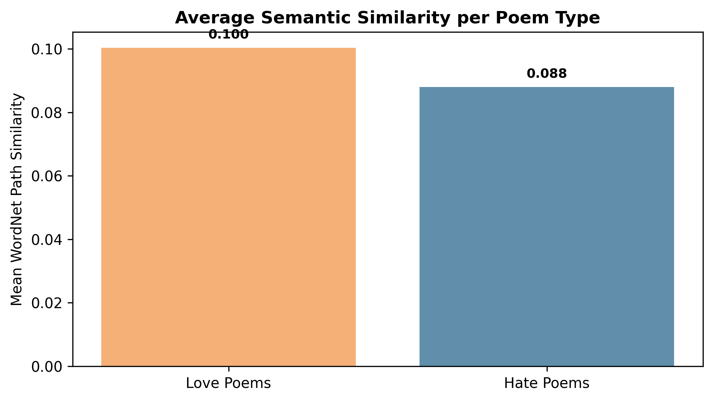
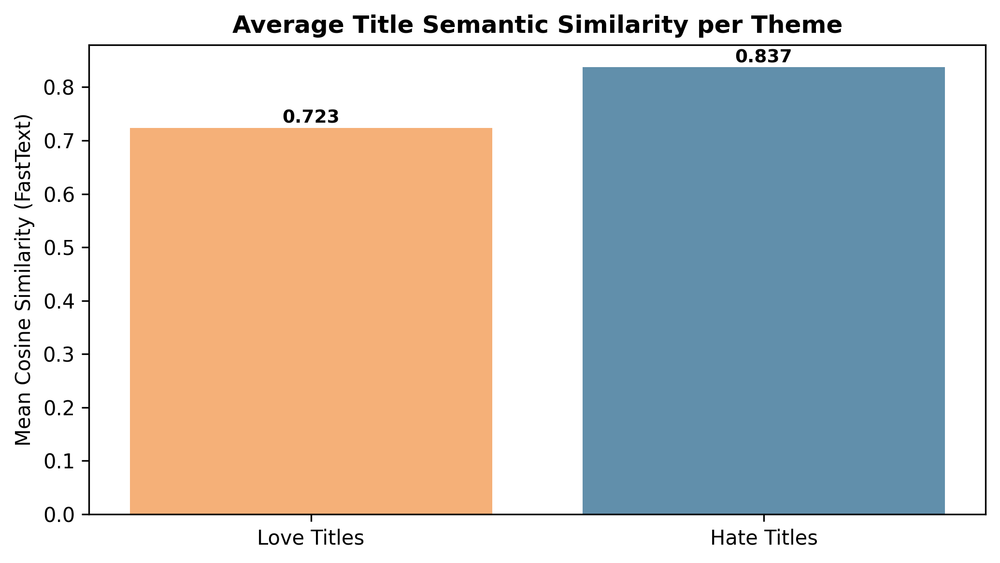

#  Love and Hate in Poetry — NLP Emotion Analysis (Project 11)

This repository contains the implementation, analysis, and report for **Project ID 11 – “Love and Hate in Poetry”**, developed for the **Natural Language Processing (NLP) course at the University of Oulu**.

It investigates how contrasting emotions — *love* and *hate* — are represented in poetry using computational linguistics.  
By combining lexicon-based analysis with semantic and contextual NLP methods, it quantifies emotional polarity across two curated poetry corpora.

---

##  **Project Overview**

| Attribute | Details |
|------------|----------|
| **Course** | Natural Language Processing (University of Oulu) |
| **Project ID** | 11 |
| **Title** | *Love and Hate in Poetry* |
| **Authors** | Rao Ikram, Muhammad Ramish |
| **Repository** | [https://github.com/Raoikram123/NLP_Project](https://github.com/Raoikram123/NLP_Project) |
| **Dataset** | 25 Love + 25 Hate/War poetry books (Project Gutenberg) |
| **Tools** | Python (NLTK, WordNet, Matplotlib, WordCloud), LaTeX (IEEE report) |

---

## ⚙️ **Pipeline Summary (Tasks 1–10)**

1. Dataset creation and labeling of 50 poetry books.  
2. Text preprocessing (lowercasing, tokenization, stopword removal).  
3. Lexicon construction (NRC EmoLex + WordNet expansion).  
4. Lexicon statistics and overlap computation.  
5. Frequency and proportion analysis of emotion terms.  
6. Sequential distance analysis between emotion words.  
7. Semantic similarity via WordNet path metrics.  
8. Per-poem semantic coherence profiling.  
9. Contextual co-occurrence mapping of emotion keywords.  
10. Visualization and interpretation of results.

---

## 📊 **Key Quantitative Findings**

| Metric | Love | Hate |
|---------|------|------|
| **Unique Lexicon Words** | 163 | 142 |
| **Shared Words** | 9 (*cry, fear, pain, etc.*) | — |
| **Avg. Word Proportion (Mean ± SD)** | 0.075 ± 0.08 | 0.028 ± 0.02 |
| **Avg. Sequential Distance (tokens)** | ≈ 45 | ≈ 61 |
| **Mean Semantic Similarity (WordNet)** | 0.100 | 0.088 |
| **Title Similarity (FastText)** | 0.723 | 0.837 |

These values confirm distinct lexical and semantic structures for positive and negative affect in poetry.

---

## 🖼️ **Visual Results**

### 1️⃣ Publication Trends by Theme  

Love and hate-themed poetry followed parallel growth patterns, peaking between 1900–1924.

---

### 2️⃣ Mean Word Occurrence Comparison  

Love poems contain roughly three times more emotion words than hate poems, validating thematic polarity.

---

### 3️⃣ Distribution of Emotion Word Proportions  

Boxplots show tighter variance in love poetry, while hate poetry demonstrates wider stylistic range.

---

### 4️⃣ Contextual Word Associations  

Love contexts emphasize tenderness (*light, heart, sweet*), while hate contexts feature conflict imagery (*blood, death, night*).

---

### 5️⃣ Sequential Distance Distributions  

Love-related words appear closer together (≈ 45 tokens), whereas hate-related words occur more sparsely (≈ 61 tokens).

---

### 6️⃣ Cross-Theme Transitions (Hate → Love)  

Cross-emotion transitions are rare, with long gaps confirming strong thematic coherence.

---

### 7️⃣ Hybrid Emotion-Weighted Token Proximity  

Both corpora show comparable semantic closeness (≈ 0.16), indicating balanced affective depth.

---

### 8️⃣ Per-Poem Semantic Similarity  

Love poems exhibit consistently higher similarity to positive lexicon categories.

---

### 9️⃣ Average Per-Poem Similarity  

Aggregate averages: Love = 0.10, Hate = 0.088 — confirming emotional cohesion.

---

### 🔟 Title-Level Semantic Similarity  

Hate-themed poem titles show greater internal consistency (0.837 vs 0.723), likely reflecting historical clustering in war poetry.

---

##  **Interpretation**

- **Love poetry** uses direct emotional vocabulary and sensory imagery.  
- **Hate poetry** conveys emotion through metaphor, aggression, and negative tone.  
- WordNet and contextual analyses confirmed affective consistency across corpora.  
- The lexicon-based method proved interpretable, reproducible, and linguistically transparent.

---

##  **Technologies Used**

- **Python:** `nltk`, `pandas`, `numpy`, `matplotlib`, `wordcloud`  
- **Lexical Resources:** WordNet, NRC Emotion Lexicon  
- **Environment:** Jupyter Notebook + IEEE LaTeX Report

---
